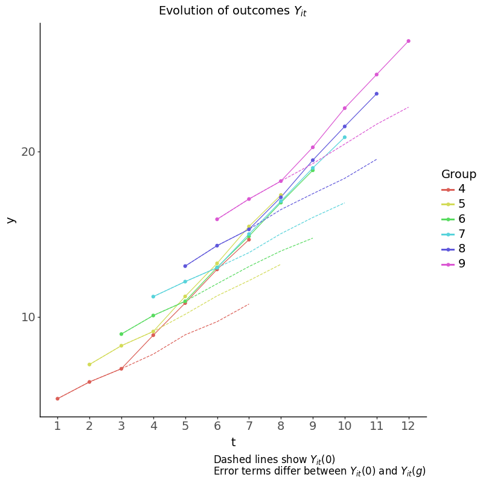
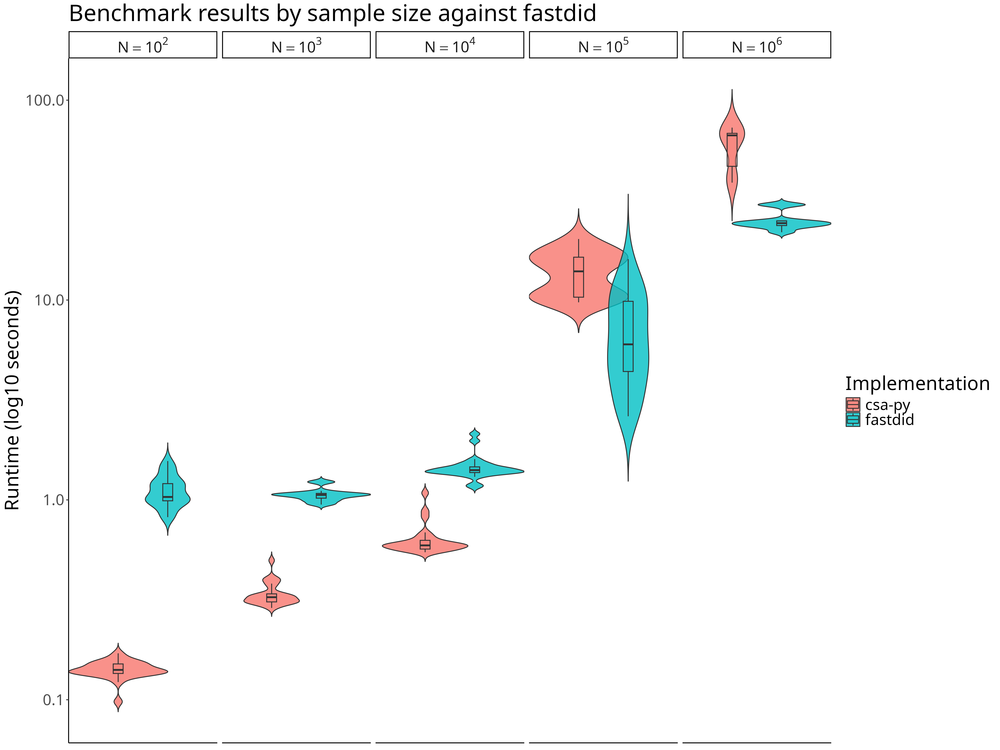

# csa-py: python implementation of the Callaway and Sant’Anna estimator


- [Installation](#installation)
  - [Try it out](#try-it-out)
- [Example](#example)
  - [Balanced panel](#balanced-panel)
  - [Unbalanced panel](#unbalanced-panel)
- [Features](#features)
  - [Inspecting group x time effects](#inspecting-group-x-time-effects)
  - [Custom group effect aggregation](#custom-group-effect-aggregation)
  - [Progress bar](#progress-bar)
- [Comparison to other packages](#comparison-to-other-packages)
  - [Benchmarking](#benchmarking)
- [Development](#development)
- [References](#references)

`csa-py` is an implementation of the [Callaway and Sant’Anna
(2021)](https://www.sciencedirect.com/science/article/abs/pii/S0304407620303948)
(CSA) estimator in Python.

[Features](#features) include:

- [Inspection](#inspecting-group-x-time-effects) of group $\times$ time
  effects
- Optional `tqdm` [progress bar](#progress-bar) (e.g. when computing
  many effects on large panels)
- [Custom group effect aggregation](#custom-group-effect-aggregation)
- Faster than the original `did` package in R and comparable to the
  `fastdid` package in R (see [benchmarking](#benchmarking) below). This
  is made possible by:
  - Quick group processing with [polars](https://docs.pola.rs/) 🐻‍❄️
  - Fast(er) (conditional) predicted probablities with
    [fastlr](https://github.com/jsr-p/fastlr?tab=readme-ov-file)

## Installation

``` bash
uv pip install git+https://github.com/jsr-p/csa-py
```

### Try it out

With [uv](https://docs.astral.sh/uv/) run the following:

``` bash
uv run --with "git+https://github.com/jsr-p/csa-py" python -i -c 'import csa
import polars as pl

mpdta = pl.read_csv("https://gist.githubusercontent.com/jsr-p/c14075f8ba00bcb56c5cb7a279c82d06/raw/9e1161fbba8ee84b95407ce9a56cecee6be71936/mpdta.csv")
res = csa.estimate(
    data=mpdta,
    outcome="lemp",
    unit="countyreal",
    group="first.treat",
    time="year",
    covariates=["lpop"],
    balanced=True,
    control="never",
    method="reg",
    verbose=False,
)
print(res)'
```

and inspect the results in the interactive shell; see [balanced
panel](#balanced-panel) for more.

## Example

### Balanced panel

Estimating the ATTs:

``` python
import polars as pl
import csa

res = csa.estimate(
    # data from https://bcallaway11.github.io/did/
    data=(mpdta := pl.read_csv("data/mpdta.csv")),
    outcome="lemp",
    unit="countyreal",
    group="first.treat",
    time="year",
    covariates=["lpop"],
    balanced=True,
    control="never",
    method="reg",
    verbose=False,
)

print(res)
```

    CsaDidResult(
      estimates=pl.DataFrame(shape=(12, 6)),
      IF=np.ndarray(shape=(500, 12), dtype=float64),
      n=500,
      atts=dict(len=12)
    )

``` python
with pl.Config(tbl_rows=12):
  # All ATT(g, t) estimates
  print(res.estimates)
```

    shape: (12, 6)
    ┌─────────────┬──────┬───────────┬──────────┬───────────┬───────────┐
    │ first.treat ┆ year ┆ att       ┆ se       ┆ lower     ┆ upper     │
    │ ---         ┆ ---  ┆ ---       ┆ ---      ┆ ---       ┆ ---       │
    │ i64         ┆ i64  ┆ f64       ┆ f64      ┆ f64       ┆ f64       │
    ╞═════════════╪══════╪═══════════╪══════════╪═══════════╪═══════════╡
    │ 2004        ┆ 2004 ┆ -0.014911 ┆ 0.022056 ┆ -0.05814  ┆ 0.028317  │
    │ 2004        ┆ 2005 ┆ -0.076996 ┆ 0.02836  ┆ -0.13258  ┆ -0.021412 │
    │ 2004        ┆ 2006 ┆ -0.14108  ┆ 0.034836 ┆ -0.209358 ┆ -0.072802 │
    │ 2004        ┆ 2007 ┆ -0.107544 ┆ 0.032738 ┆ -0.171709 ┆ -0.04338  │
    │ 2006        ┆ 2004 ┆ -0.002066 ┆ 0.022122 ┆ -0.045425 ┆ 0.041293  │
    │ 2006        ┆ 2005 ┆ -0.006968 ┆ 0.018346 ┆ -0.042925 ┆ 0.028989  │
    │ 2006        ┆ 2006 ┆ 0.000766  ┆ 0.019196 ┆ -0.036858 ┆ 0.038389  │
    │ 2006        ┆ 2007 ┆ -0.041536 ┆ 0.019717 ┆ -0.08018  ┆ -0.002891 │
    │ 2007        ┆ 2004 ┆ 0.026366  ┆ 0.014019 ┆ -0.001111 ┆ 0.053842  │
    │ 2007        ┆ 2005 ┆ -0.00476  ┆ 0.01567  ┆ -0.035472 ┆ 0.025953  │
    │ 2007        ┆ 2006 ┆ -0.028502 ┆ 0.018132 ┆ -0.06404  ┆ 0.007036  │
    │ 2007        ┆ 2007 ┆ -0.028789 ┆ 0.016168 ┆ -0.060478 ┆ 0.002899  │
    └─────────────┴──────┴───────────┴──────────┴───────────┴───────────┘

A summary ala. the original R `did` package is also available as:

``` python
res.summary()
```

    Group-Time Average Treatment Effects:
      Group    Time    ATT(g, t)    Std. Error    [95% Pointwise.    Conf. Band]
       2004    2004      -0.0149        0.0221            -0.0581         0.0283
       2004    2005      -0.0770        0.0284            -0.1326        -0.0214  *
       2004    2006      -0.1411        0.0348            -0.2094        -0.0728  *
       2004    2007      -0.1075        0.0327            -0.1717        -0.0434  *
       2006    2004      -0.0021        0.0221            -0.0454         0.0413
       2006    2005      -0.0070        0.0183            -0.0429         0.0290
       2006    2006       0.0008        0.0192            -0.0369         0.0384
       2006    2007      -0.0415        0.0197            -0.0802        -0.0029  *
       2007    2004       0.0264        0.0140            -0.0011         0.0538
       2007    2005      -0.0048        0.0157            -0.0355         0.0260
       2007    2006      -0.0285        0.0181            -0.0640         0.0070
       2007    2007      -0.0288        0.0162            -0.0605         0.0029
    ---
    Signif. codes: `*' confidence band does not cover 0
    Control group: Never treated
    Estimation Method: Outcome Regression

The default estimation method is the Outcome Regression
(`method="reg"`); to use the double robust estimator use `method="dr"`:

``` python
csa.estimate(
    data=mpdta,
    outcome="lemp",
    unit="countyreal",
    group="first.treat",
    time="year",
    covariates=["lpop"],
    balanced=True,
    control="never",
    method="dr",
    verbose=False,
).summary()
```

    Group-Time Average Treatment Effects:
      Group    Time    ATT(g, t)    Std. Error    [95% Pointwise.    Conf. Band]
       2004    2004      -0.0145        0.0221            -0.0579         0.0288
       2004    2005      -0.0764        0.0287            -0.1326        -0.0202  *
       2004    2006      -0.1404        0.0354            -0.2098        -0.0711  *
       2004    2007      -0.1069        0.0329            -0.1714        -0.0424  *
       2006    2004      -0.0005        0.0222            -0.0440         0.0431
       2006    2005      -0.0062        0.0185            -0.0425         0.0300
       2006    2006       0.0010        0.0194            -0.0371         0.0390
       2006    2007      -0.0413        0.0197            -0.0799        -0.0026  *
       2007    2004       0.0267        0.0141            -0.0008         0.0543
       2007    2005      -0.0046        0.0157            -0.0354         0.0262
       2007    2006      -0.0284        0.0182            -0.0641         0.0072
       2007    2007      -0.0288        0.0162            -0.0606         0.0030
    ---
    Signif. codes: `*' confidence band does not cover 0
    Control group: Never treated
    Estimation Method: Doubly Robust

#### Dynamic effects

Aggregating dynamic effects (with relative horizon $k := t - G$):

``` python
dynamic_te = csa.agg_te(res, method="dynamic")
print(dynamic_te)
```

    AggTeResult(
      estimates=pl.DataFrame(shape=(7, 5)),
      overall_att=-0.08078174533376158,
      overall_se=0.018745854711475496,
      IF=np.ndarray(shape=(500, 7), dtype=float64),
      IF_overall=np.ndarray(shape=(500,), dtype=float64),
      method='dynamic',
      IFs_weight=dict(len=7)
    )

The estimates are shown as:

``` python
print(dynamic_te.estimates)
```

    shape: (7, 5)
    ┌─────┬───────────┬──────────┬───────────┬───────────┐
    │ k   ┆ att       ┆ se       ┆ lower     ┆ upper     │
    │ --- ┆ ---       ┆ ---      ┆ ---       ┆ ---       │
    │ i64 ┆ f64       ┆ f64      ┆ f64       ┆ f64       │
    ╞═════╪═══════════╪══════════╪═══════════╪═══════════╡
    │ -3  ┆ 0.026366  ┆ 0.014019 ┆ -0.001111 ┆ 0.053842  │
    │ -2  ┆ -0.00413  ┆ 0.012917 ┆ -0.029447 ┆ 0.021188  │
    │ -1  ┆ -0.023465 ┆ 0.014442 ┆ -0.05177  ┆ 0.00484   │
    │ 0   ┆ -0.021147 ┆ 0.011481 ┆ -0.043649 ┆ 0.001356  │
    │ 1   ┆ -0.053356 ┆ 0.016293 ┆ -0.08529  ┆ -0.021422 │
    │ 2   ┆ -0.14108  ┆ 0.034836 ┆ -0.209358 ┆ -0.072802 │
    │ 3   ┆ -0.107544 ┆ 0.032738 ┆ -0.171709 ┆ -0.04338  │
    └─────┴───────────┴──────────┴───────────┴───────────┘

The overall ATT (aggregated across all groups and $k \geq 0$) equals:

``` python
print(
  f"Overall ATT = {dynamic_te.overall_att:.4f} "
  f"(SE = {dynamic_te.overall_se:.4f})",
)
```

    Overall ATT = -0.0808 (SE = 0.0187)

A summary ala. the original R `did` package is also available as:

``` python
dynamic_te.summary()
```

    Overall summary of ATT's based on event-study/dynamic aggregation:
        ATT    Std. Error    [95%      Conf. Band]
    -0.0808        0.0187   -0.1175        -0.0440  *

    Dynamic effects:
      Event time    Estimate    Std. Error    [95% Pointwise    Conf. Band]
              -3      0.0264        0.0140           -0.0011         0.0538
              -2     -0.0041        0.0129           -0.0294         0.0212
              -1     -0.0235        0.0144           -0.0518         0.0048
               0     -0.0211        0.0115           -0.0436         0.0014
               1     -0.0534        0.0163           -0.0853        -0.0214  *
               2     -0.1411        0.0348           -0.2094        -0.0728  *
               3     -0.1075        0.0327           -0.1717        -0.0434  *
    ---
    Signif. codes: `*' confidence band does not cover 0
    Control group: Never treated
    Estimation Method: Outcome Regression

We can also bootstrap the dynamic effects to get simultaneous confidence
intervals using the multiplier bootstrap (see the algorithm defined on
p. 215 in [CSA
paper](https://www.sciencedirect.com/science/article/abs/pii/S0304407620303948)
and [multiplier.py](src/csa/multiplier.py)):

``` python
import numpy as np

np.random.seed(42)
dynamic_te = csa.agg_te(res, method="dynamic", boot=True)
print(dynamic_te.boot.estimates)
```

    shape: (7, 5)
    ┌─────┬───────────┬──────────┬───────────┬───────────┐
    │ k   ┆ att       ┆ se       ┆ lower     ┆ upper     │
    │ --- ┆ ---       ┆ ---      ┆ ---       ┆ ---       │
    │ i64 ┆ f64       ┆ f64      ┆ f64       ┆ f64       │
    ╞═════╪═══════════╪══════════╪═══════════╪═══════════╡
    │ -3  ┆ 0.026366  ┆ 0.013005 ┆ -0.007303 ┆ 0.060035  │
    │ -2  ┆ -0.00413  ┆ 0.01298  ┆ -0.037734 ┆ 0.029475  │
    │ -1  ┆ -0.023465 ┆ 0.014593 ┆ -0.061245 ┆ 0.014315  │
    │ 0   ┆ -0.021147 ┆ 0.011862 ┆ -0.051856 ┆ 0.009562  │
    │ 1   ┆ -0.053356 ┆ 0.016254 ┆ -0.095434 ┆ -0.011278 │
    │ 2   ┆ -0.14108  ┆ 0.035916 ┆ -0.234061 ┆ -0.048099 │
    │ 3   ┆ -0.107544 ┆ 0.031933 ┆ -0.190213 ┆ -0.024875 │
    └─────┴───────────┴──────────┴───────────┴───────────┘

with overall effect:

``` python
print(
  f"Overall ATT = {dynamic_te.overall_att:.4f} "
  f"(SE = {dynamic_te.boot.overall.se.item():.4f})",
)
```

    Overall ATT = -0.0808 (SE = 0.0187)

or more succintly:

``` python
dynamic_te.summary()
```

    Overall summary of ATT's based on event-study/dynamic aggregation:
        ATT    Std. Error    [95%      Conf. Band]
    -0.0808        0.0187   -0.1163        -0.0453  *

    Dynamic effects:
      Event time    Estimate    Std. Error    [95% Simult.    Conf. Band]
              -3      0.0264        0.0140         -0.0011         0.0538
              -2     -0.0041        0.0129         -0.0294         0.0212
              -1     -0.0235        0.0144         -0.0518         0.0048
               0     -0.0211        0.0115         -0.0436         0.0014
               1     -0.0534        0.0163         -0.0853        -0.0214  *
               2     -0.1411        0.0348         -0.2094        -0.0728  *
               3     -0.1075        0.0327         -0.1717        -0.0434  *
    ---
    Signif. codes: `*' confidence band does not cover 0
    Control group: Never treated
    Estimation Method: Outcome Regression

> Note the `95% Simult.` vs. `95% Pointwise` from before; the confidence
> intervals are now simultaneous across all periods at once.

#### Group effects

Aggregating group effects:

``` python
group_te = csa.agg_te(res, method="group")
print(group_te.estimates)
```

    shape: (3, 5)
    ┌─────────────┬───────────┬──────────┬───────────┬───────────┐
    │ first.treat ┆ att       ┆ se       ┆ lower     ┆ upper     │
    │ ---         ┆ ---       ┆ ---      ┆ ---       ┆ ---       │
    │ i64         ┆ f64       ┆ f64      ┆ f64       ┆ f64       │
    ╞═════════════╪═══════════╪══════════╪═══════════╪═══════════╡
    │ 2004        ┆ -0.085133 ┆ 0.024251 ┆ -0.132664 ┆ -0.037601 │
    │ 2006        ┆ -0.020385 ┆ 0.017403 ┆ -0.054493 ┆ 0.013723  │
    │ 2007        ┆ -0.028789 ┆ 0.016168 ┆ -0.060478 ┆ 0.002899  │
    └─────────────┴───────────┴──────────┴───────────┴───────────┘

``` python
group_te.summary()
```

    Overall summary of ATT's based on group/cohort aggregation:
        ATT    Std. Error    [95%      Conf. Band]
    -0.0329        0.0119   -0.0562        -0.0097  *

    Group effects:
      Group    Estimate    Std. Error    [95% Pointwise    Conf. Band]
       2004     -0.0851        0.0243           -0.1327        -0.0376  *
       2006     -0.0204        0.0174           -0.0545         0.0137
       2007     -0.0288        0.0162           -0.0605         0.0029
    ---
    Signif. codes: `*' confidence band does not cover 0
    Control group: Never treated
    Estimation Method: Outcome Regression

#### Calendar effects

Aggregating calendar effects:

``` python
calendar_te = csa.agg_te(res, method="calendar")
print(calendar_te.estimates)
```

    shape: (4, 5)
    ┌──────┬───────────┬──────────┬───────────┬───────────┐
    │ year ┆ att       ┆ se       ┆ lower     ┆ upper     │
    │ ---  ┆ ---       ┆ ---      ┆ ---       ┆ ---       │
    │ i64  ┆ f64       ┆ f64      ┆ f64       ┆ f64       │
    ╞══════╪═══════════╪══════════╪═══════════╪═══════════╡
    │ 2004 ┆ -0.014911 ┆ 0.022056 ┆ -0.05814  ┆ 0.028317  │
    │ 2005 ┆ -0.076996 ┆ 0.02836  ┆ -0.13258  ┆ -0.021412 │
    │ 2006 ┆ -0.046516 ┆ 0.020998 ┆ -0.087672 ┆ -0.00536  │
    │ 2007 ┆ -0.039705 ┆ 0.012866 ┆ -0.064922 ┆ -0.014489 │
    └──────┴───────────┴──────────┴───────────┴───────────┘

``` python
calendar_te.summary()
```

    Overall summary of ATT's based on calendar time aggregation:
        ATT    Std. Error    [95%      Conf. Band]
    -0.0445        0.0149   -0.0737        -0.0154  *

    Time effects:
      Time    Estimate    Std. Error    [95% Pointwise    Conf. Band]
      2004     -0.0149        0.0221           -0.0581         0.0283
      2005     -0.0770        0.0284           -0.1326        -0.0214  *
      2006     -0.0465        0.0210           -0.0877        -0.0054  *
      2007     -0.0397        0.0129           -0.0649        -0.0145  *
    ---
    Signif. codes: `*' confidence band does not cover 0
    Control group: Never treated
    Estimation Method: Outcome Regression

#### Simple effect

Aggregating simple effect (i.e. average effect in post-horizon periods,
$k \geq
0$):

``` python
simple_te = csa.agg_te(res, method="simple")
print(simple_te.estimates)
```

    shape: (1, 5)
    ┌─────────┬───────────┬──────────┬─────────┬───────────┐
    │ effect  ┆ att       ┆ se       ┆ lower   ┆ upper     │
    │ ---     ┆ ---       ┆ ---      ┆ ---     ┆ ---       │
    │ str     ┆ f64       ┆ f64      ┆ f64     ┆ f64       │
    ╞═════════╪═══════════╪══════════╪═════════╪═══════════╡
    │ overall ┆ -0.041969 ┆ 0.011445 ┆ -0.0644 ┆ -0.019537 │
    └─────────┴───────────┴──────────┴─────────┴───────────┘

``` python
simple_te.summary()
```

        ATT    Std. Error    [95%      Conf. Band]
    -0.0420        0.0114   -0.0644        -0.0195  *

### Unbalanced panel

Estimating the ATTs on an unbalanced panel with evolution of outcomes
as:



The data is simulated with `python scripts/sim_test.py simub`; see
`data_test` in [Justfile](Justfile).

``` python
data = pl.read_csv("data/testing/sim_ub.csv")
print(data.head())
```

    shape: (5, 8)
    ┌─────┬─────┬─────┬─────┬─────┬───────────┬──────────┬──────────┐
    │ id  ┆ pt  ┆ g   ┆ t   ┆ K   ┆ X         ┆ y0       ┆ y        │
    │ --- ┆ --- ┆ --- ┆ --- ┆ --- ┆ ---       ┆ ---      ┆ ---      │
    │ i64 ┆ i64 ┆ i64 ┆ i64 ┆ i64 ┆ f64       ┆ f64      ┆ f64      │
    ╞═════╪═════╪═════╪═════╪═════╪═══════════╪══════════╪══════════╡
    │ 0   ┆ 0   ┆ 6   ┆ 3   ┆ -3  ┆ -0.406317 ┆ 5.833266 ┆ 5.833266 │
    │ 0   ┆ 0   ┆ 6   ┆ 4   ┆ -2  ┆ -0.406317 ┆ 3.902666 ┆ 3.902666 │
    │ 0   ┆ 0   ┆ 6   ┆ 5   ┆ -1  ┆ -0.406317 ┆ 2.942913 ┆ 2.942913 │
    │ 0   ┆ 1   ┆ 6   ┆ 6   ┆ 0   ┆ -0.406317 ┆ 2.697752 ┆ 5.063043 │
    │ 0   ┆ 1   ┆ 6   ┆ 7   ┆ 1   ┆ -0.406317 ┆ 2.846276 ┆ 3.785909 │
    └─────┴─────┴─────┴─────┴─────┴───────────┴──────────┴──────────┘

``` python
res_ub = csa.estimate(
    data=data,
    group="g",
    time="t",
    outcome="y",
    unit="id",
    covariates=["X"],
    balanced=False,
    control="notyet",
    verbose=False,
    method="dr",
)

# Estimates are NaN when no valid control group exist for the effect
print(res_ub.estimates)
```

    shape: (28, 6)
    ┌─────┬─────┬───────────┬──────────┬───────────┬───────────┐
    │ g   ┆ t   ┆ att       ┆ se       ┆ lower     ┆ upper     │
    │ --- ┆ --- ┆ ---       ┆ ---      ┆ ---       ┆ ---       │
    │ i64 ┆ i64 ┆ f64       ┆ f64      ┆ f64       ┆ f64       │
    ╞═════╪═════╪═══════════╪══════════╪═══════════╪═══════════╡
    │ 4   ┆ 2   ┆ NaN       ┆ NaN      ┆ NaN       ┆ NaN       │
    │ 4   ┆ 3   ┆ -0.67955  ┆ 0.146673 ┆ -0.967025 ┆ -0.392075 │
    │ 4   ┆ 4   ┆ 0.45157   ┆ 0.134338 ┆ 0.188272  ┆ 0.714867  │
    │ 4   ┆ 5   ┆ 1.074521  ┆ 0.163479 ┆ 0.754109  ┆ 1.394934  │
    │ 4   ┆ 6   ┆ NaN       ┆ NaN      ┆ NaN       ┆ NaN       │
    │ …   ┆ …   ┆ …         ┆ …        ┆ …         ┆ …         │
    │ 7   ┆ 8   ┆ 2.109208  ┆ 0.151619 ┆ 1.81204   ┆ 2.406375  │
    │ 8   ┆ 5   ┆ NaN       ┆ NaN      ┆ NaN       ┆ NaN       │
    │ 8   ┆ 6   ┆ -0.551015 ┆ 0.163906 ┆ -0.872264 ┆ -0.229766 │
    │ 8   ┆ 7   ┆ -0.147197 ┆ 0.158528 ┆ -0.457907 ┆ 0.163513  │
    │ 8   ┆ 8   ┆ 0.97703   ┆ 0.158914 ┆ 0.665565  ┆ 1.288495  │
    └─────┴─────┴───────────┴──────────┴───────────┴───────────┘

``` python
# all summaries :=)
csa.agg_te(res_ub, method="dynamic").summary(); print("\n***")
csa.agg_te(res_ub, method="group").summary(); print("\n***")
csa.agg_te(res_ub, method="calendar").summary()
```

    Overall summary of ATT's based on event-study/dynamic aggregation:
       ATT    Std. Error    [95%      Conf. Band]
    1.1244        0.0639    0.9991         1.2497  *

    Dynamic effects:
      Event time    Estimate    Std. Error    [95% Pointwise    Conf. Band]
              -2     -0.7474        0.0994           -0.9421        -0.5526  *
              -1     -0.5886        0.0686           -0.7232        -0.4541  *
               0      0.7776        0.0634            0.6533         0.9020  *
               1      1.4711        0.0808            1.3127         1.6296  *
    ---
    Signif. codes: `*' confidence band does not cover 0
    Control group: Not yet treated
    Estimation Method: Doubly Robust

    ***
    Overall summary of ATT's based on group/cohort aggregation:
       ATT    Std. Error    [95%      Conf. Band]
    1.0798        0.0636    0.9550         1.2045  *

    Group effects:
      Group    Estimate    Std. Error    [95% Pointwise    Conf. Band]
          4      0.7630        0.1264            0.5154         1.0107  *
          5      1.1082        0.1271            0.8591         1.3574  *
          6      0.9423        0.1430            0.6621         1.2226  *
          7      1.5841        0.1178            1.3532         1.8150  *
          8      0.9770        0.1589            0.6656         1.2885  *
    ---
    Signif. codes: `*' confidence band does not cover 0
    Control group: Not yet treated
    Estimation Method: Doubly Robust

    ***
    Overall summary of ATT's based on calendar time aggregation:
       ATT    Std. Error    [95%      Conf. Band]
    1.0337        0.0620    0.9121         1.1552  *

    Time effects:
      Time    Estimate    Std. Error    [95% Pointwise    Conf. Band]
         4      0.4516        0.1343            0.1883         0.7149  *
         5      0.9637        0.1173            0.7337         1.1936  *
         6      0.9900        0.1191            0.7566         1.2234  *
         7      1.1673        0.1148            0.9422         1.3924  *
         8      1.5958        0.1261            1.3486         1.8430  *
    ---
    Signif. codes: `*' confidence band does not cover 0
    Control group: Not yet treated
    Estimation Method: Doubly Robust

## Features

### Inspecting group x time effects

`csa-py` supports inspection of a given $ATT(g, t)$ after estimation;
e.g. who were the controls for the effect $ATT(g, t)$?

All computed effects are stored in the dictionary `atts` of the results
object.

As an example, we can inspect the `atts` map for the estimated effect
for group $2004$ in year $2007$:

``` python
g = 2004
t = 2007
print(att := res.atts[(g, t)]) # Inspect ATT(g, t)
```

    ATT(
      att=np.float64(-0.10754427467304643),
      IF=np.ndarray(shape=(329, 1), dtype=float64),
      g=2004,
      t=2007,
      ids=pl.DataFrame(shape=(329, 2))
    )

From the `ATT` object we can see the controls used for the effect:

``` python
if isinstance(att, csa.ATT):
  # G = 1 treated; G = 0 controls.
  print(att.ids.head())
  print(att.ids["G"].value_counts())
```

    shape: (5, 2)
    ┌────────────┬─────┐
    │ countyreal ┆ G   │
    │ ---        ┆ --- │
    │ i64        ┆ i8  │
    ╞════════════╪═════╡
    │ 23         ┆ 0   │
    │ 24         ┆ 0   │
    │ 25         ┆ 0   │
    │ 26         ┆ 0   │
    │ 27         ┆ 0   │
    └────────────┴─────┘
    shape: (2, 2)
    ┌─────┬───────┐
    │ G   ┆ count │
    │ --- ┆ ---   │
    │ i8  ┆ u32   │
    ╞═════╪═══════╡
    │ 0   ┆ 309   │
    │ 1   ┆ 20    │
    └─────┴───────┘

A helper function `csa.get_controls` extracts the controls for a given
`ATT` object and `CsaDidResult` results object:

``` python
import typing

# lil' typing hack
att = typing.cast(csa.ATT, att)
controls = csa.get_controls(att, res)
# unit id and group for each control
print(controls.head())
```

    shape: (5, 2)
    ┌────────────┬─────────────┐
    │ countyreal ┆ first.treat │
    │ ---        ┆ ---         │
    │ i64        ┆ i64         │
    ╞════════════╪═════════════╡
    │ 16017      ┆ 0           │
    │ 18109      ┆ 0           │
    │ 18035      ┆ 0           │
    │ 13093      ┆ 0           │
    │ 51515      ┆ 0           │
    └────────────┴─────────────┘

``` python
print(f"#Controls = {controls.shape[0]}")
print(controls["first.treat"].value_counts())
```

    #Controls = 309
    shape: (1, 2)
    ┌─────────────┬───────┐
    │ first.treat ┆ count │
    │ ---         ┆ ---   │
    │ i64         ┆ u32   │
    ╞═════════════╪═══════╡
    │ 0           ┆ 309   │
    └─────────────┴───────┘

From the output we see that only the never-treated (`first.treat = 0`)
are controls for $ATT(2004, 2007)$ above.

> Note that implementation wise I set $G = 0$ for the never-treated
> although the notation in the paper (and in the literature) is
> $G = \infty$.

------------------------------------------------------------------------

In the [unbalanced panel](#unbalanced-panel) example it becomes a bit
more interesting. Consider $ATT(5, 6)$; who are the controls for thise
effect in the unbalanced panel and using as controls the not-yet-treated
units? This can be found as follows:

``` python
att = res_ub.atts[(5, 6)]
if isinstance(att, csa.ATT):
    controls = csa.get_controls(att, res_ub)
    print(controls["g"].value_counts().sort("g"))
```

    shape: (3, 2)
    ┌─────┬───────┐
    │ g   ┆ count │
    │ --- ┆ ---   │
    │ i64 ┆ u32   │
    ╞═════╪═══════╡
    │ 7   ┆ 182   │
    │ 8   ┆ 151   │
    │ 9   ┆ 164   │
    └─────┴───────┘

I.e. the controls for those with $G = 5$ in period $t = 6$ are those
with $G
\in \{7, 8, 9\}$; the not-yet-treated at $t = 6$.

### Custom group effect aggregation

`csa-py` allows for aggregating effects into custom made groups (based
on the treatment dates). E.g. can define $$
\mathcal{G}_{1} = \{2004, 2005\}, \ \ \mathcal{G}_{2} = \{2006, 2007\}
$$ and aggregate the effects for those two collection of treatment
groups (the 2005 group doesn’t exist in the `mpdta` but the point is
still valid).

This can be done as follows:

``` python
agg_res = csa.agg_te_custom_group(
    res,
    # Mapping from unit id to custom group `str` val
    custom_group_map={
        0: "0",
        2004: "2004-2005",
        2005: "2004-2005",
        2006: "2006-2007",
        2007: "2006-2007",
    },
    verbose=False,
)
print(agg_res.estimates)
```

    shape: (2, 5)
    ┌─────────────┬───────────┬──────────┬───────────┬───────────┐
    │ first.treat ┆ att       ┆ se       ┆ lower     ┆ upper     │
    │ ---         ┆ ---       ┆ ---      ┆ ---       ┆ ---       │
    │ str         ┆ f64       ┆ f64      ┆ f64       ┆ f64       │
    ╞═════════════╪═══════════╪══════════╪═══════════╪═══════════╡
    │ 2004-2005   ┆ -0.085133 ┆ 0.024251 ┆ -0.132664 ┆ -0.037601 │
    │ 2006-2007   ┆ -0.023187 ┆ 0.012482 ┆ -0.047651 ┆ 0.001278  │
    └─────────────┴───────────┴──────────┴───────────┴───────────┘

### Progress bar


Thanks [`tqdm`](https://github.com/tqdm/tqdm)!

## Comparison to other packages

- [did](https://bcallaway11.github.io/did/) is the original R package
  for the CSA estimator
- [fastdid](https://tsailintung.github.io/fastdid/index.html) is a fast
  alternative to the `did` package in R. Unfortunately `fastdid` does
  not support *unbalanced* panels when using the double robust
  estimator. This is a frequent use case in practice when working with
  microdata and datasets that are “trimmed” i.e. each unit is observed
  for a fixed window around the event time (here the panel is unbalanced
  by construction). The `csa-py` package supports this use case.

> Note: This package was mainly developed to sharpen my own
> understanding.

### Benchmarking

#### Benchmark against `fastdid` package in R



- This experiment is akin to the benchmarking experiment conducted in
  the `fastdid` package, see
  [here](https://tsailintung.github.io/fastdid/articles/misc.html)
- To reproduce the figure see `bench-fastdid` in the
  [Justfile](Justfile)
- Note: in the figure, for $N \in \{10^{2}, 10^{3}, 10^{4}, 10^{5}\}$
  the number of benchmark iterations equal $25$; for $N = 10^{6}$ the
  number of benchmark iterations equal $10$.
- The fastdid
  [experiment](https://tsailintung.github.io/fastdid/articles/misc.html)
  also plots the runtime for the original `did` package; hence this
  package is also (much) faster than the original `did` package in R
  (also in the unbalanced panel setting)

<!-- #### Benchmark against `did` package in R -->

<!---->

<!-- Simulation experiment on unbalanced panels for varying amount of periods around cut-off and (`delta` parameter in figure) and varying amount of periods (`#T`). -->

<!---->

<!-- {width=500px} -->

<!---->

<!-- See [script](scripts/benchmark/bench_did.sh) -->

<!-- and `bench-csa` in the [Justfile](Justfile). -->

## Development

``` bash
git clone git@github.com:jsr-p/csa-py.git
cd csa-py
uv venv
uv sync --all-extras
```

## References

[CSA
paper](https://www.sciencedirect.com/science/article/abs/pii/S0304407620303948)
